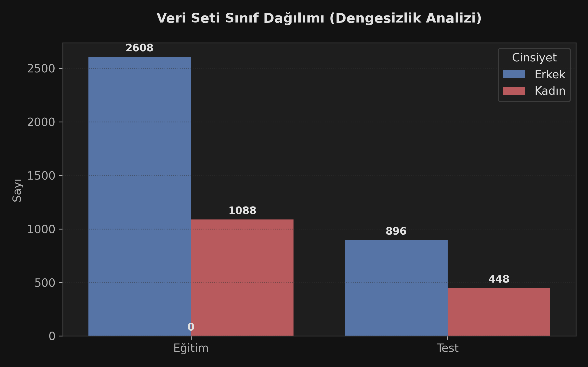
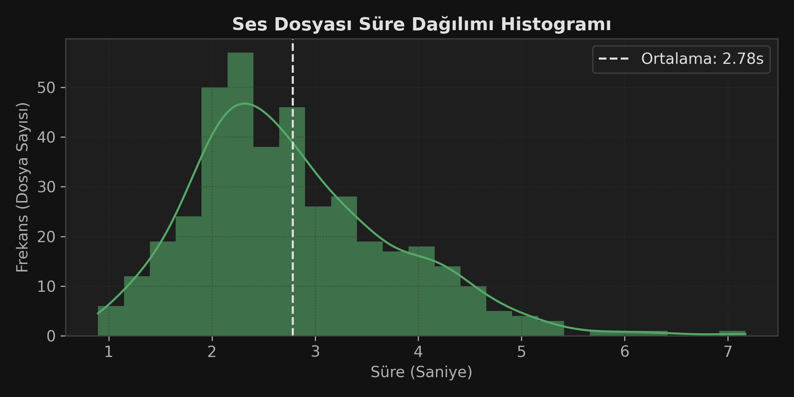
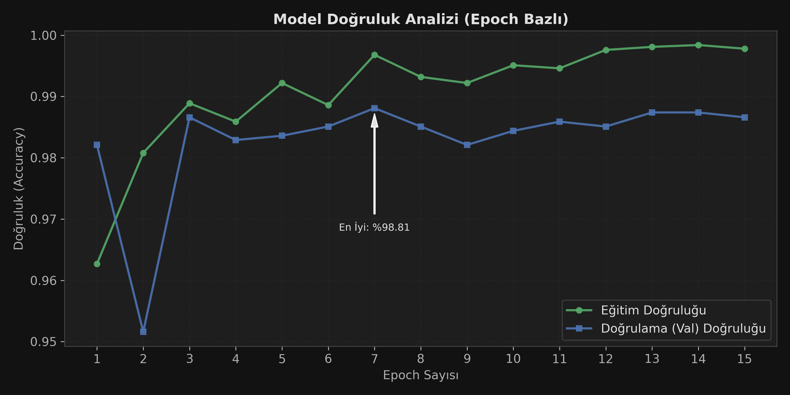
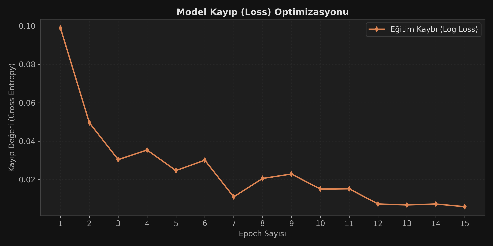
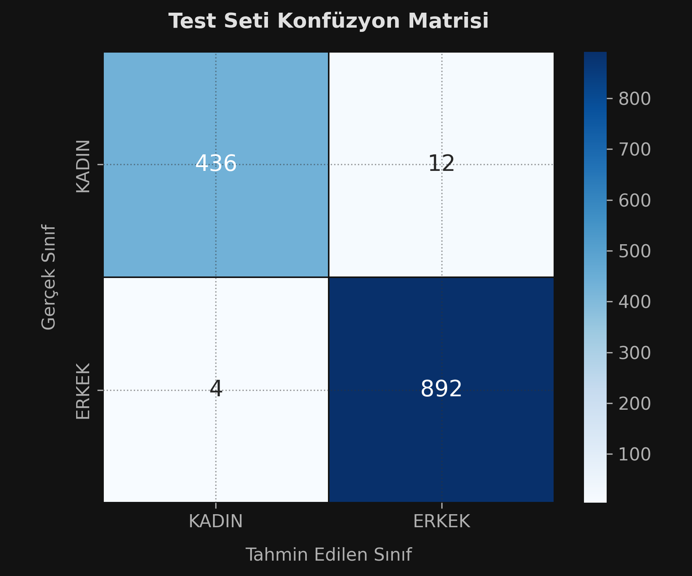
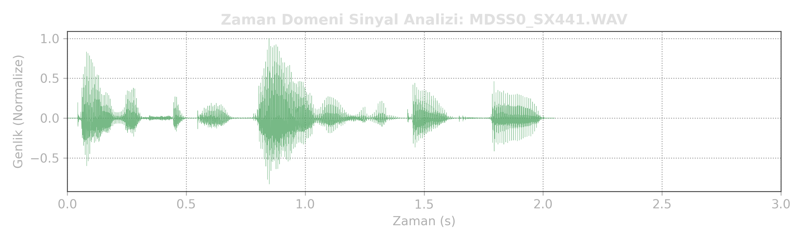

# 🎙️ TIMIT Gerçek Zamanlı Cinsiyet Tanıma Sistemi


TIMIT veri seti üzerinde eğitilmiş, gürültüye dayanıklı **ECAPA-TDNN** mimarisini kullanan uçtan uca bir ses analiz sistemidir.

---

## 📊 1. Veri Analizi ve EDA (Exploratory Data Analysis)

Model geliştirmeye başlamadan önce veri seti üzerinde kapsamlı bir analiz yapılmıştır.

### A. Sınıf Dağılımı
TIMIT veri seti doğası gereği dengesizdir (%70 Erkek, %30 Kadın). Bu durum, eğitim sırasında **WeightedRandomSampler** kullanılarak çözülmüştür.

<p align="center">
  
  
</p>

*Grafik 1: Eğitim ve Test setlerindeki cinsiyet dağılımı. Grafik 2: Ses dosyalarının süre histogramı (Genellikle 3-4 saniye aralığında yoğunlaşmıştır).*

---

## 📈 2. Eğitim Süreci ve Performans (Learning Curves)

Model, 15 Epoch boyunca **AdamW** optimizasyonu ve **Cosine Annealing** öğrenme oranı planlayıcısı ile eğitilmiştir.

### Eğitim Metrikleri
Aşağıdaki grafiklerde görüldüğü üzere, model **7. Epoch** civarında kararlı hale gelmiş ve **%98** doğruluk bandına oturmuştur. Overfitting (aşırı öğrenme) belirtisi görülmemektedir.

<p align="center">
  
</p>
<p align="center">
  
</p>

### Test Sonuçları (Confusion Matrix)
Model, hiç görmediği **1344 adet test ses dosyasında** değerlendirilmiş ve aşağıdaki sonuçlar elde edilmiştir:

| Metrik | Değer |
| :--- | :--- |
| **Genel Doğruluk** | **%98.81** |
| F1-Skoru (Erkek) | 0.991 |
| F1-Skoru (Kadın) | 0.982 |

<p align="center">
  
</p>

*Model sadece 16 adet hatalı tahmin yapmıştır.*

---

## 🧠 3. Model Mimarisi: ECAPA-TDNN

Sistemin kalbinde, hoparlör ve cinsiyet tanıma görevlerinde endüstri standardı (SOTA) kabul edilen **ECAPA-TDNN (Emphasized Channel Attention, Propagation and Aggregation)** mimarisi yatmaktadır. Bu mimari, basit CNN'lere göre konuşmacı özelliklerini (embedding) çok daha gürbüz bir şekilde çıkarır.

### Temel Bileşenler

1.  **TDNN (Time Delay Neural Network):**
    * Klasik 2D-CNN'lerin aksine, ses sinyalini bir zaman serisi olarak işler (1D Konvolüsyon).
    * Genişletilmiş (Dilated) konvolüsyonlar sayesinde, model sadece anlık sesi değil, geniş bir zamansal bağlamı (temporal context) görerek karar verir.

2.  **SE-Res2Net Blokları (Kanal Dikkati):**
    * **Res2Net:** Özellikleri farklı ölçeklerde işleyerek hem ince (tiz sesler) hem kaba (pes sesler) detayları yakalar.
    * **Squeeze-and-Excitation (SE):** Dinamik bir dikkat mekanizmasıdır. Model, her bir frekans kanalının önemini anlık olarak hesaplar. Örneğin, arka planda gürültü varsa o frekansları baskılar, insan sesinin olduğu kanalları güçlendirir.

3.  **Çok Ölçekli Özellik Birleştirme (Aggregation):**
    * Modelin farklı derinlikteki katmanlarından gelen çıktılar birleştirilir (Concatenation). Böylece hem sığ katmanlardaki basit özellikler hem de derin katmanlardaki soyut özellikler son kararda etkili olur.

4.  **ASP (Attentive Statistics Pooling):**
    * Değişken uzunluktaki ses kliplerini (3sn, 5sn, 10sn) sabit boyutlu bir vektöre indirger.
    * Standart ortalama yerine **Dikkat (Attention)** ağırlıklı ortalama alır. Sessiz veya gürültülü karelere düşük ağırlık vererek modelin sadece aktif konuşmaya odaklanmasını sağlar.

<p align="center">
  
</p>

---

## 🚀 Kurulum

```bash
pip install -r requirements.txt
# Windows için ffmpeg.exe dosyasını proje klasörüne ekleyin.
```

## ▶️ Çalıştırma

```bash
streamlit run app.py
```

---


